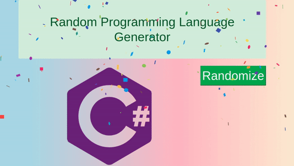

# Random programming language generator

> 📌 This is a random programming langauge generator 📊

  
   
   

  

## Vision
I was looking for a visual programming langauge generator online and I could not find one. Therefor I decided to make my own in reactJs. I know that some of the options aren't actually considered "languages" and are frameworks/libaries and ect'
but bare with me haha lol.

### Prerequisites
Make sure you have node package manager NPM on your machine.
  - if not you can download it <a href="https://nodejs.org/en/"> Here </a>
  
 Make sure you have ReactJS on your machine.
  - if not you can download it <a href="https://reactjs.org/"> Here </a>

### Developing locally
=> Clone this repo `git clone https://github.com/micaelillos/randomProgrammingLanguage.git`

=> Install dependecies `npm install`

=> Start development server `npm start`

### Live Demo
You can use the generator by clicking <a href="https://randev.micaelill.com"> Here </a>

##### Feel free to fork this repo to make it your own (choose your own languages / styles and ect')

## Author
* **Micael Illos** - *Get in touch* - <a href="https://micaelil.com"> Website </a>
